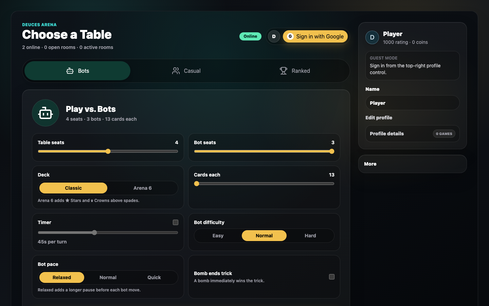

# Deuces Arena

[](https://github.com/Kabirsarora/deuces-arena/actions/workflows/ci.yml)

Real-time multiplayer Big Two / Deuces platform with bot opponents, replay analysis, and ML-ready strategy coaching.

**Live demo:** [deucesarena.com](https://deucesarena.com)

Licensed under the [MIT License](LICENSE). Development guidelines are in [CONTRIBUTING.md](CONTRIBUTING.md).



## Current Features

- Pure TypeScript game engine with card models, hand detection, comparison rules, legal move generation, server-safe state transitions, distinct random, lowest-legal, and simulation-guided bot levels, replays, ratings, move evaluation, and replay state reconstruction for simulation-based decision comparison.
- Mobile-first Next.js table for human and bot play, with selected-card motion, trick display, turn state, uncluttered game-over summaries, move timelines, and on-demand simulation review.
- Expo / React Native mobile foundation with native Play, Rooms, Ranked, and Profile tabs; configurable bot matches, system share sheets, and safe room-invitation deep links reuse the production Socket.IO server, shared contracts, and pure TypeScript game engine.
- Socket.IO rooms with server-authoritative move validation, reconnect support, disconnect grace auto-moves, ready states, leave-room flow, invite links, bot fill, moderated table chat, player mute/block/report controls, realtime rate limits, live lobby discovery, open-room counts, human activity counts, and replay export.
- Private creator moderation console for reviewing player reports and product feedback, with signed admin authorization, report status tracking, stronger profanity filtering, request-size limits, and browser security headers.
- Optional casual-only card trading with a timed pregame window, private one-for-one requests, atomic engine validation, one completed trade per player, and replay history; ranked mode never permits trading.
- Guest profiles with searchable match history, leaderboard data, placement-based ratings, bombs played, moves played, and cards remaining at game end.
- Signed-in and public profile pages with Google account photos, account stats, recent match summaries, copyable share text, Arena Coins, and cosmetic inventory.
- Move Lab analysis that ranks legal moves with heuristic-guided Monte Carlo rollouts and random exploration, plus post-match review that reconstructs high-choice turns and compares the selected move with simulated alternatives. Results show rollout completion and 95% win-rate intervals instead of claiming solved strategy.
- Shop and Locker with catalog APIs, server-validated Arena Coin purchases, earned unlock tracking, profile loadouts, equip validation, account-photo fallbacks, original card/table artwork, ranked borders, and tournament rewards.
- Arena Coins earned from completed casual, ranked, and tournament games. Coins cannot be purchased, transferred, or wagered.
- Ranked matchmaking for four verified humans with no bots, a 45-second clock, placement-based rating changes, six visible rating tiers, tier progress, bonus coin rewards, and earned rank borders.
- Eight-player Arena Cup tournaments with two simultaneous four-player semifinals, automatic top-two advancement, a four-player final, a live bracket, coin prizes, a champion cosmetic, and durable tournament history on player profiles.
- Prisma/PostgreSQL schema and migrations for users, matches, tournament brackets, match players, move history, coach evaluations, cosmetic unlocks/equipment, replay labels, and future AI/model scores.
- Early ML package for random self-play sample generation and JSONL export of persisted coach evaluations without pretending baseline bots are trained AI.

## Architecture

```text
apps/web             Next.js, React, Tailwind, Framer Motion UI
apps/mobile          Expo, React Native, Expo Router native client
apps/server          Express + Socket.IO realtime authority
packages/game-engine Pure TypeScript rules, bots, replay, ratings, simulations
packages/shared      Socket contracts and public DTOs
packages/db          Prisma schema, migrations, seeds
packages/ml          Self-play and coach-evaluation data export scripts
```

The engine is deliberately independent from React and the server. The Expo client already reuses the rules and shared Socket.IO contracts while replacing the web UI with native screens. The replay format, persistence model, and AI/simulation tooling remain reusable across both clients.

## Game Rules

Deuces Arena implements classic 4-player Deuces / Big Two plus a casual Arena 6 table variant:

- Each player receives 13 cards.
- Card rank order is `3 4 5 6 7 8 9 10 J Q K A 2`.
- Classic suit order is diamonds, clubs, hearts, spades.
- Arena 6 uses a 78-card deck and adds Stars and Crowns above spades, so the full order is diamonds, clubs, hearts, spades, stars, crowns.
- Casual rooms can choose 2-6 seats and custom cards per player when the selected deck has enough cards.
- The player holding 3 of diamonds starts, and the first play must include it.
- The lead player chooses the trick type: single, pair, trips, quad, full house, straight, longer straight, or bomb.
- Players must answer with the same hand type and straight length, unless they play a bomb.
- Players may pass even if they have a legal answer.
- When everyone else passes, the last valid player wins the trick and leads the next one.
- First player to empty their hand wins.

Bomb variants:

- A bomb is four of a kind plus one kicker.
- A bomb beats any non-bomb hand.
- Bomb strength is determined by the rank of the four of a kind; the kicker is ignored.
- Default room rule: once a bomb is active, only a stronger bomb can beat it.
- Optional room rule: a bomb immediately wins the trick, so no stronger bomb response is allowed.
- Arena 6 pairs, trips, and quads may use any of its six suits.
- Arena 6 bombs remain exactly four matching cards plus one off-rank kicker. Five or six cards of one rank are not a separate hand type.
- These are intentionally documented as variant choices so more house rules can be added later.

## Local Setup

```bash
npm install
npm run dev --workspace @deuces-arena/web
npm run dev --workspace @deuces-arena/server
npm run dev:mobile
```

The web app defaults to `http://localhost:3000`; the realtime server defaults to `http://localhost:4000`. The mobile client starts Expo and uses `https://api.deucesarena.com` unless `EXPO_PUBLIC_SERVER_URL` is set in `apps/mobile/.env.local`.

Google sign-in is optional for local development. Without auth credentials, the app still works with
guest profiles stored by browser. To test Google sign-in, create a `.env.local` for `apps/web` with
`AUTH_SECRET`, `AUTH_GOOGLE_ID`, and `AUTH_GOOGLE_SECRET`, then configure the Google OAuth redirect
URI as `http://localhost:3000/api/auth/callback/google`. Set the same server-only
`REALTIME_AUTH_SECRET` on the web app and realtime server to bind Socket.IO actions to the signed-in
account; guests can continue using casual rooms without it.

Useful backend endpoints:

- `GET /health`: service health, safe config metadata, uptime, and active room count.
- `GET /lobby`: public room/activity snapshot.
- `GET /leaderboard`: persisted or in-memory guest leaderboard.
- `GET /cosmetics`: active cosmetic catalog.
- `GET /profiles/:guestId/tournaments`: persisted Arena Cup entries, advancement, and placements.
- `GET /admin/moderation`: protected creator queue for recent reports and feedback.

## Database Setup

The app runs without a database for local UI and engine work. To persist match history, move events, and guest profile stats, set `DATABASE_URL` in your environment using a PostgreSQL database such as Neon or Supabase.

Prisma ORM 7 keeps the database URL in `packages/db/prisma.config.ts`, while `schema.prisma` only defines the data model.

```bash
npm run db:generate --workspace @deuces-arena/db
npm run db:migrate --workspace @deuces-arena/db
npm run db:seed --workspace @deuces-arena/db
```

The seed creates starter cosmetics used by the catalog and progression rules. In no-database mode, the server provides the same starter catalog as a safe fallback.

## Data and Progression

Move and match data are stored in a shape that can later become ML training data: selected move, hand before, current trick before, legal move count, cards remaining before/after, placement, replay events, and optional simulation/model score fields.

Current cosmetic progression is intentionally simple:

- Complete 1 persisted match: unlock `classic-red-card-back`.
- Win 1 persisted match: unlock `midnight-felt-table`.
- Additional milestones scale from 8 wins through 75 wins for the rarest avatars, tables, and card backs; premium visuals are deliberately long-term rewards.
- Reaching Gold, Platinum, Diamond, or Arena Master unlocks the matching ranked profile border.
- Winning an Arena Cup unlocks the tournament champion border.
- Supporter cosmetics are modeled separately and do not affect gameplay.
- Arena Coins are earned from completed matches, with additional ranked placement and tournament prizes, and are not purchasable or bettable.
- Cosmetic coin purchases are server-validated and only unlock non-supporter presentation items such as card backs, table themes, avatars, and profile borders.
- Configured creator/admin accounts receive unlimited coin access and automatically own every current and future cosmetic without changing competitive gameplay.

## ML Data Export

After setting `DATABASE_URL`, persisted Move Lab records can be exported as JSONL for offline analysis.

```bash
COACH_EVALUATION_EXPORT_PATH=artifacts/coach-evaluations.jsonl npm run export:coach-evaluations --workspace @deuces-arena/ml
```

## Verification

GitHub Actions runs the same verification suite on pushes to `main`, `codex/**` branches, and pull requests.

```bash
npm run format
npm run lint
npm run typecheck
npm run test
npm run build
```

Current automated coverage includes engine rule tests, bot and rollout behavior tests, replay/rating/ranked-tier tests, chat sanitization and moderation tests, cosmetic progression tests, and Socket.IO integration tests for room creation, lobby visibility, ready/start flow, bot fill, chat broadcast, ranked matchmaking and account isolation, tournament seeding, card trading, feedback rate limits, admin authorization, request-size limits, Move Lab authorization, replay export, cosmetics catalog/profile fields, and equip validation.

The server defaults to a 15-second disconnected-player grace delay before it makes a safe lowest-legal move for the abandoned active seat. Hosted environments can tune this with `DISCONNECTED_AUTO_MOVE_DELAY_MS`, and confirm the active value through `GET /health`.

## Deployment

See [docs/deployment.md](docs/deployment.md) for web, server, database, and environment variable deployment notes.
Use [docs/demo-readiness.md](docs/demo-readiness.md) before sharing a hosted link or recording a walkthrough.

## Roadmap

- Finish production OAuth verification and continue polishing mobile layout, animations, and accessibility.
- Add Redis-backed room and matchmaking durability for backend restarts and future multi-instance hosting.
- Expand ranked and tournament matchmaking with rating bands, durable queue health, rating history, reconnect recovery, and additional anti-abuse checks.
- Tune Arena 6 balance from public match data while keeping its finalized six-suit rules backward compatible.
- Benchmark and tune the current mixed-policy Monte Carlo evaluator with larger self-play datasets.
- Build grounded AI coach explanations and replay mistake detection from legal moves, replay state, rollout outcomes, and future model scores.
- Expand post-game analysis beyond the current replay timeline, labels, filters, and Move Lab records.
- Expand the current non-pay-to-win cosmetic catalog and supporter presentation options.
- Link EAS, test the completed native account, queue, chat, cosmetic, history, reconnect, and notification-registration flows on physical devices.
- Test and enable the completed ranked/tournament alert pipeline on signed development builds, then prepare store artwork, accessibility testing, and App Store / Google Play submissions.
- Add a separate native iOS Messages extension that sends Deuces Arena room invitations and game state inside group conversations.

## Known Limitations

- Easy and normal bots are transparent baselines. Hard bots use bounded simulations, not a trained model or solved strategy.
- Move Lab uses heuristic-guided Monte Carlo simulation with random exploration; its wide confidence ranges make clear that recommendations are estimates, not perfect strategy.
- Production Google auth depends on correctly configured OAuth credentials and callback URLs.
- Database persistence is optional locally; without `DATABASE_URL`, stats and match history use safe in-memory fallbacks.
- Ranked and tournament queues currently live in one server process and are lost if that process restarts; Redis-backed durability and multi-instance coordination are future work.
- Advanced anti-cheat detection, automated moderation penalties, and payment flows are future work.

## Resume Targets

- Built a real-time multiplayer Big Two platform with Next.js, TypeScript, Socket.IO, PostgreSQL, Prisma, and reusable monorepo packages for game logic, shared contracts, persistence, and ML experiments.
- Developed a server-authoritative TypeScript game engine with legal move generation, replayable state transitions, baseline bots, trick validation, bomb rules, and structured move logging.
- Designed an AI-readiness pipeline with heuristic-guided Monte Carlo move evaluation, uncertainty reporting, coach-analysis replay records, self-play generation, and JSONL export for future model training.
- Implemented live room discovery, authenticated profiles, placement-based ranked tiers, eight-player tournament brackets, replay exports, persistent moderation controls, non-pay-to-win cosmetic progression, and server-validated cosmetic loadouts.
