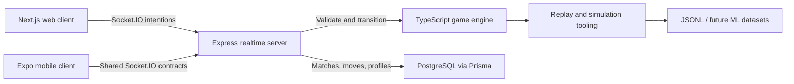

# Deuces Arena

[](https://github.com/Kabirsarora/deuces-arena/actions/workflows/ci.yml)
[](https://deucesarena.com)
[](LICENSE)

Deuces Arena is a real-time multiplayer platform for Deuces / Big Two. It combines a reusable
TypeScript game engine, server-authoritative Socket.IO rooms, PostgreSQL match history, ranked and
tournament play, simulation-backed move review, bots, and non-pay-to-win cosmetic progression.

**[Play the hosted web app](https://deucesarena.com)** | **[Architecture](docs/architecture.md)** |
**[Roadmap](docs/roadmap.md)** | **[Deployment guide](docs/deployment.md)**


## Why This Project

Deuces Arena began as a way to turn a card game my family plays regularly into a substantial
full-stack engineering project. The goal is not to imitate intelligence with fixed strategy rules.
The project first establishes correct, replayable game logic and structured move data, then builds
toward stronger bots and analysis through simulation, self-play, and future model evaluation.

The result is designed as a real product rather than a single-page game demo: multiple clients share
the same engine and contracts, the server owns competitive state, and completed matches become
structured data that can support replays and later strategy research.

## Project Status

- **Web:** Publicly deployed at [deucesarena.com](https://deucesarena.com).
- **Realtime backend:** Deployed as a separate long-running Socket.IO service.
- **Persistence:** PostgreSQL-backed profiles, matches, moves, ratings, tournaments, moderation,
  cosmetics, and replay-analysis records.
- **Mobile:** Expo / React Native client implemented in the monorepo and awaiting signed-device,
  notification, and store-release testing.
- **AI/ML:** Baseline bots, Monte Carlo move evaluation, self-play generation, and JSONL exports are
  implemented. No trained strategy model is presented as finished AI.

## Technical Highlights

- Pure TypeScript engine for card ranking, legal move generation, hand detection and comparison,
  bombs, passing, trick resolution, placements, ratings, replays, bots, and simulations.
- Server-authoritative online play: clients submit intentions while the server validates and advances
  the canonical game state.
- Realtime room lifecycle with creation, discovery, ready states, reconnects, disconnect grace moves,
  host transfer, bot fill, timers, chat, invitations, and replay export.
- Structured persistence for each match, player placement, move context, cards remaining, ratings,
  simulation results, replay labels, and future model scores.
- Four-player authenticated ranked matchmaking with placement-based rating changes and visible tiers.
- Eight-player tournaments with two semifinals, automatic advancement, a final, durable bracket
  history, rewards, and a champion cosmetic.
- Privacy-conscious account bridge between Auth.js on Vercel and the Socket.IO authority without
  exposing OAuth secrets to clients.
- Shared contracts and engine code reused by the Next.js web client and Expo mobile client.
- Automated formatting, linting, typechecking, tests, builds, and mobile release checks in GitHub
  Actions.

## Architecture



| Workspace              | Responsibility                                             |
| ---------------------- | ---------------------------------------------------------- |
| `apps/web`             | Next.js, React, Tailwind CSS, Framer Motion, Auth.js       |
| `apps/server`          | Express, Socket.IO, authoritative rooms and matchmaking    |
| `apps/mobile`          | Expo, React Native, native navigation and account handoff  |
| `packages/game-engine` | Pure TypeScript rules, bots, replays, ratings, simulations |
| `packages/shared`      | Cross-client Socket.IO contracts and public DTOs           |
| `packages/db`          | Prisma schema, migrations, database client, seed data      |
| `packages/ml`          | Self-play generation and evaluation-data exports           |

The engine contains no React code and does not depend on a browser or database. This boundary keeps
gameplay deterministic, testable, and portable to future clients.

## Player Features

- Guest play and Google account sign-in
- Human-vs-bot, casual rooms, ranked matchmaking, and Arena Cup tournaments
- Configurable 2-6 player casual tables, timers, bot count, bot pace, difficulty, and house rules
- Classic four-suit and experimental six-suit Arena 6 decks
- Moderated table chat with blocking, muting, reporting, and rate limits
- Public community feedback with signed-in posting, creator replies, progress statuses, and
  policy-reason moderation
- Optional casual-only, server-validated pregame card trading
- Profiles, match history, leaderboards, rating tiers, and tournament history
- Arena Coins earned through play, plus server-validated cosmetic purchases and loadouts
- Card backs, card fronts, table themes, avatars, borders, and progression rewards
- Post-match summaries, replay timelines, and simulation-based Move Lab comparisons

Arena Coins cannot be purchased, transferred, or wagered. Cosmetics never change legal moves,
ratings, matchmaking, bot behavior, or any competitive rule.

## Rules Implemented

The default game is four-player Deuces / Big Two:

- Rank order: `3 4 5 6 7 8 9 10 J Q K A 2`.
- Suit order: diamonds, clubs, hearts, spades.
- The holder of 3 of diamonds starts, and the opening play must include it.
- Supported hands: singles, pairs, trips, quads, full houses, straights of five or more cards, and
  bombs.
- Responses match the current hand type and, for straights, the exact length.
- Passing is always allowed. Once every other active player passes, the last player to make a valid
  play leads the next trick.
- A bomb is four cards of one rank plus an off-rank kicker. Bomb strength uses the four-card rank;
  the kicker is ignored.
- The first player to empty their hand wins.

Casual rooms expose documented variants, including bombs that immediately end a trick and Arena 6,
which adds Stars and Crowns above spades. See [architecture.md](docs/architecture.md) for the full
rule decisions.

## Getting Started

### Prerequisites

- Node.js 20 or newer
- npm 10 or newer
- PostgreSQL only when persistent accounts and match data are needed

### Install

```bash
git clone https://github.com/Kabirsarora/deuces-arena.git
cd deuces-arena
npm install
cp apps/web/.env.example apps/web/.env.local
cp apps/server/.env.example apps/server/.env
```

The example environment files are enough for guest-mode local development. Google sign-in and
PostgreSQL are optional.

### Run the Web App

Start the realtime server:

```bash
npm run dev --workspace @deuces-arena/server
```

In another terminal, start Next.js:

```bash
npm run dev --workspace @deuces-arena/web
```

Open [http://localhost:3000](http://localhost:3000). The realtime server defaults to
`http://localhost:4000`.

### Optional Database

Set `DATABASE_URL` in `packages/db/.env` and `apps/server/.env`, then run:

```bash
npm run db:generate --workspace @deuces-arena/db
npm run db:migrate:deploy --workspace @deuces-arena/db
npm run db:seed --workspace @deuces-arena/db
```

Without PostgreSQL, the server intentionally falls back to in-memory rooms, profiles, chat, replay
state, and starter cosmetics so engine and UI work remain accessible.

### Optional Mobile Client

```bash
npm run dev:mobile
```

See [apps/mobile/README.md](apps/mobile/README.md) for native account handoff, development builds,
deep links, notification credentials, and release testing.

## Verification

```bash
npm run format
npm run lint
npm run typecheck
npm run test
npm run build
```

Automated tests cover engine rules, legal moves, bots, simulations, ratings, replay reconstruction,
chat moderation, persistence behavior, mobile auth, notifications, and Socket.IO room, ranked,
tournament, trade, replay, moderation, and cosmetic flows. GitHub Actions runs the complete
verification suite on pull requests and pushes to `main` and `codex/**` branches.

## Data and AI Direction

Move records are designed for later strategy work and can include the hand before a decision, current
trick, selected move, legal-move count, remaining cards, final placement, simulation score, and future
model score. Persisted Move Lab evaluations can be exported for offline analysis:

```bash
COACH_EVALUATION_EXPORT_PATH=artifacts/coach-evaluations.jsonl \
  npm run export:coach-evaluations --workspace @deuces-arena/ml
```

The intended progression is: correct engine, transparent baseline bots, structured data, Monte Carlo
evaluation, self-play, stronger simulation policies, then carefully evaluated policy or value models.
The project does not claim that its current bots represent solved or optimal Deuces strategy.

## Security and Privacy

- Online moves and cosmetic mutations are validated by the server.
- Authentication secrets and the PostgreSQL connection string remain server-side.
- Admin moderation routes require short-lived signed authorization.
- Chat and reports have sanitization, size limits, rate limits, and moderation controls.
- Public room state never includes another player's private hand.
- Analytics are configured for aggregate product usage rather than invasive player tracking.

Security reports should not include credentials, access tokens, private user data, or live exploit
details in a public issue. Contact the repository owner privately for sensitive disclosures.

## Deployment

The production web app uses Vercel, the long-running WebSocket server uses Render, and PostgreSQL is
hosted on Neon. This split allows the realtime process to remain stateful while the web client uses
Next.js hosting and CDN behavior.

See [deployment.md](docs/deployment.md) for environment variables, OAuth callbacks, migrations,
provider commands, account bridging, mobile app links, and production smoke testing. Use
[demo-readiness.md](docs/demo-readiness.md) before public demonstrations.

## Known Limitations

- Ranked queues and active rooms currently live in one server process; Redis-backed durability and
  multi-instance coordination remain future work.
- Free-tier backend hosting can introduce a cold-start delay after inactivity.
- Hard bots use bounded simulation and heuristic policies, not a trained strategy model.
- The native client still requires signed-device, push-notification, accessibility, and store-review
  testing before public mobile release.
- Advanced anti-cheat detection, automated moderation penalties, payments, and the iOS Messages
  extension are not production features.

## Documentation

- [Architecture](docs/architecture.md)
- [Deployment](docs/deployment.md)
- [Demo readiness](docs/demo-readiness.md)
- [Mobile release](docs/mobile-release.md)
- [Product roadmap](docs/roadmap.md)
- [Asset licenses](ASSET_LICENSES.md)
- [Contributing](CONTRIBUTING.md)

## License

Released under the [MIT License](LICENSE).
